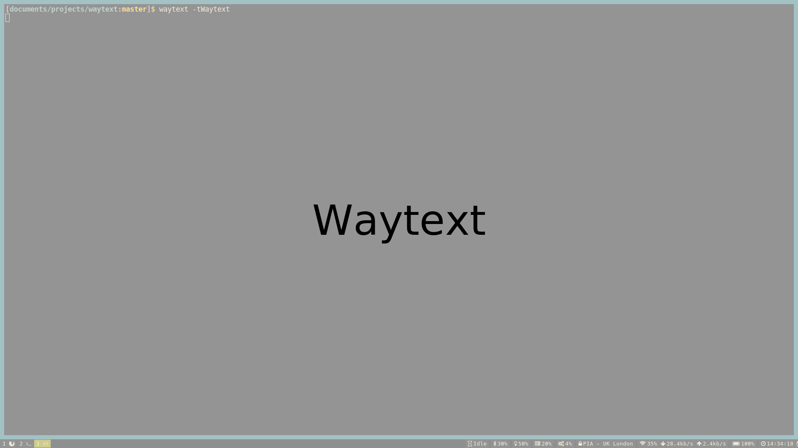

# waytext

Display text on all outputs with colouring.  Useful for getting attention such
as for taking breaks or other alerts.

It currently works on Sway 1.0.



## Usage

```sh
waytext -h
```

When shown, the user can dismiss the display using `Escape` or using the left
mouse button.

## Building

Install dependencies:
* meson
* wayland
* cairo
* scdoc (optional: man pages)

Then run, using the provided `Makefile`:

```sh
make build
make install
```
Or manually:

```sh
meson build
ninja -C build
build/waytext
```


## Contributing

Any contributions are welcome, via issues or pull requests.

## Thanks

This is currently largely code from [slurp][1], adapted for this purpose.

## License

MIT

[1]: https://github.com/emersion/slurp
[2]: https://lists.sr.ht/%7Eemersion/public-inbox
